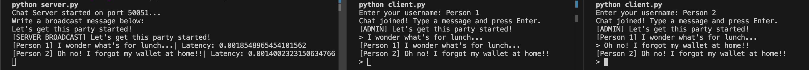

## gRPC Python Realtime Chat Demo

Steps to reproduce:

### 1. Set up your environment

Run:

```bash
just env
```

#### Manual Setup:

You may run:

```bash
pipenv install
```

and then

```bash
pipenv shell
```

to install the dependencies listed in the Pipfile.

### 2. Generate Protobufs

You may run

```bash
just generate
```

or
`python -m grpc_tools.protoc -I. --python_out=. --grpc_python_out=. chat.proto`

### 3. Start Server + Clients

```
just server
just client
```

OR

```
python server.py
python client.py
```


